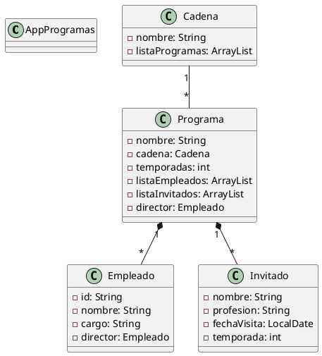

# Práctica 1. El Formiguero y La Rebelión

## ÍNDICE
1. [Introducción](#1-introducción)
2. [Estructura de clases](#2-estructura-de-clases)
    - Diagrama UML
    - Código PlantUML
3. [Contenido de las clases](#3-contenido-de-las-clases)
4. [Programa principal](#4-programa-principal)
5. [Pruebas](#5-pruebas)
6. [Entrega](#6-entrega)

---

## 1. Introducción

Este proyecto es una aplicación en Java que gestiona programas de televisión, empleados e invitados. Se basa en el problema planteado por Jordi, quien necesita crear una aplicación para registrar datos sobre dos programas de TV: "El Formiguero" y "La Rebelión".

La aplicación permite:
- Crear cadenas de TV con múltiples programas
- Gestionar empleados (directores, técnicos, presentadores, colaboradores)
- Registrar invitados con sus fechas de visita
- Realizar búsquedas y conteos de invitados
- Validar datos de entrada

---

## 2. Estructura de clases

El programa utiliza **Programación Orientada a Objetos (POO)** y se organiza en las siguientes clases:

### Diagrama UML

```
┌─────────────────────────────────────────────┐
│              AppProgramas                    │
│  (main - Clase ejecutable)                   │
└─────────────────────────────────────────────┘
              ↓
┌─────────────────────────────────────────────┐
│           Cadena (1)                         │
│  - nombre: String                            │
│  - listaProgramas: ArrayList<Programa>       │
└─────────────────────────────────────────────┘
              ↓ (contiene 1 a *)
┌─────────────────────────────────────────────┐
│           Programa (1)                       │
│  - nombre: String                            │
│  - cadena: Cadena                            │
│  - temporadas: int                           │
│  - listaEmpleados: ArrayList<Empleado>       │
│  - listaInvitados: ArrayList<Invitado>       │
│  - director: Empleado                        │
└─────────────────────────────────────────────┘
       ↓ (emplea)         ↓ (invita)
┌──────────────────┐  ┌──────────────────┐
│    Empleado      │  │    Invitado      │
│  - id: String    │  │  - nombre: Str   │
│  - nombre: Str   │  │  - profesion: Str│
│  - cargo: String │  │  - fechaVisita   │
│  - director: Emp │  │  - temporada: int│
└──────────────────┘  └──────────────────┘
```

### Código PlantUML



---

## 3. Contenido de las clases

### **Cadena.java**

Representa una cadena de televisión que contiene múltiples programas.

```java
@Getter
public class Cadena {
    @Setter
    private String nombre;
    private ArrayList<Programa> listaProgramas = new ArrayList<>();

    public Cadena(String nombre) {
        this.nombre = nombre;
    }

    public void crearPrograma(Programa programa) {
        listaProgramas.add(programa);
    }

    public void borrarPrograma(Programa programa) {
        listaProgramas.remove(programa);
    }
}
```

**Explicación:**
- Almacena el nombre de la cadena (ej: "Antena 3", "TVE")
- Mantiene una lista de programas que pertenecen a la cadena
- Permite crear y eliminar programas dinámicamente

---

### **Programa.java**

Representa un programa de TV con empleados e invitados.

```java
@Getter
public class Programa {
    @Setter
    private String nombre;
    @Setter
    private Cadena cadena;
    private int temporadas;
    private ArrayList<Empleado> listaEmpleados;
    private ArrayList<Invitado> listaInvitados;
    @Setter
    private Empleado director;

    public Programa(String nombre, Cadena cadena, String nombreDirector) {
        this.nombre = nombre;
        this.cadena = cadena;
        this.director = new Empleado(nombreDirector, "Director", null);
        listaEmpleados.add(director);
    }
}
```

**Métodos principales:**
- `crearEmpleado()` - Añade un empleado a la lista
- `crearInvitado()` - Añade un invitado (con fecha automática)
- `buscarInvitado()` - Busca si un invitado existe (retorna true/false)
- `vecesInvitado()` - Cuenta cuántas veces vino un invitado
- `contadorInvitados()` - Muestra invitados de una temporada

---

### **Empleado.java**

Representa un empleado del programa con ID autogenerado.

```java
public class Empleado {
    private static int contador = 0;
    private String id;           // EP001, EP002, etc.
    private String nombre;
    private String cargo;        // director, técnico, presentador, colaborador
    private Empleado director;   // null si es director

    public Empleado(String nombre, String cargo, Empleado director) {
        contador++;
        this.id = String.format("EP%03d", contador);
        this.nombre = nombre;
        setCargo(cargo);
        if (cargo.equalsIgnoreCase("director")) {
            this.director = null;  // Los directores no tienen director
        } else {
            this.director = director;
        }
    }
}
```

**Características especiales:**
- IDs autogenerados y secuenciales (EP001, EP002, etc.)
- Validación de cargos: solo permite director, técnico, presentador, colaborador
- Si se introduce un cargo inválido → se asigna "empleado" por defecto
- Los directores siempre tienen `director = null`

---

### **Invitado.java**

Representa un invitado en el programa.

```java
@Getter
@Setter
public class Invitado {
    private String nombre;
    private String profesion;
    private LocalDate fechaVisita;
    private int temporada;

    // Constructor 1: Con fecha proporcionada
    public Invitado(String nombre, String profesion, int temporada, LocalDate fechaVisita) {
        this.nombre = nombre;
        this.profesion = profesion;
        this.temporada = temporada;
        setFechaVisita(fechaVisita);
    }

    // Constructor 2: Pide fecha por teclado
    public Invitado(String nombre, String profesion, int temporada) {
        Scanner teclado = new Scanner(System.in);
        this.nombre = nombre;
        this.profesion = profesion;
        this.temporada = temporada;
        // Pide año, mes, día por teclado
        // Valida que sea >= 2026 y una fecha válida
    }
}
```

**Dos constructores:**
1. **Con LocalDate**: Para testing sin entrada de usuario
2. **Con Scanner**: Pide fecha por teclado con validaciones

---

## 4. Programa principal

**AppProgramas.java** es la clase ejecutable que demuestra el funcionamiento:

```java
public class AppProgramas {
    public static void main(String[] args) {
        // Crear cadena
        Cadena antena3 = new Cadena("Antena 3");

        // Crear programa con director
        Programa el_hormiguero = new Programa("El Hormiguero", antena3, "Director1");

        // Añadir empleados
        el_hormiguero.crearEmpleado("Pablo Motos", "presentador", null);

        // Añadir invitados
        el_hormiguero.crearInvitado("Aitana", "cantante", 1);
    }
}
```

> [!NOTE]
> Al crear un invitado sin pasar una fecha (constructor con Scanner), el programa pide la fecha por teclado.

---

## 5. Pruebas

### **Pruebas unitarias con JUnit5**

He creado la clase `ProgramaInvitadoTest.java` con 5 tests principales:

1. **testCrearInvitadoYVerificarQueEsteEnLaLista**
   - Verifica que al crear un invitado, se añade a la lista
   - Assert: `assertEquals(invitadosAntes + 1, invitadosDespues)`

2. **testBorrarInvitadoYVerificarQueSeHayaRemovido**
   - Verifica que al borrar un invitado, desaparece de la lista
   - Assert: `assertFalse(programa.buscarInvitado(nombre))`

3. **testContarVecesQueUnInvitadoHaVisitadoElPrograma**
   - Cuenta cuántas veces visitó un invitado (3 veces en distintas temporadas)
   - Assert: `assertEquals(3, veces)`

4. **testBuscarUnInvitadoQueExiste**
   - Busca un invitado que sí existe
   - Assert: `assertTrue(existe)`

5. **testBuscarUnInvitadoQueNoExiste**
   - Busca un invitado que no existe
   - Assert: `assertFalse(existe)`

> [!IMPORTANT]
> He utilizado **ChatGPT** para ayuda en la estructura y mejora de los tests con JUnit5.

### **Plan de pruebas manual (AppProgramasPruebas.java)**

Contiene 12 casos de prueba para detectar errores y validaciones:

| Caso | Descripción | Resultado esperado |
|------|-------------|-------------------|
| 1 | Borrar un invitado que no existe | No se elimina, mensaje de error |
| 2 | Buscar invitado que no existe | Retorna false |
| 3 | Contar invitados de temporada que no existe | Retorna 0 |
| 4 | Rastrear invitado inexistente | Mensaje: "no ha asistido nunca" |
| 6 | Crear director con director asignado | Se asigna null al director |
| 7 | Borrar empleado que no existe | No se elimina, mensaje de error |
| 8 | Intentar acceder a invitados de programa sin invitados | Lista vacía |
| 9 | Cargo inválido | Se asigna "empleado" por defecto |
| 10 | Fecha inválida (año fuera de rango) | Error: año debe ser >= 2026 |
| 11 | Fecha inválida (mes fuera de rango) | Error: mes debe estar entre 1-12 |
| 12 | Fecha inválida (día fuera de rango) | Error: día debe estar entre 1-31 |

---

## 6. Entrega

- [x] **Código**: [GitHub - POO-CFGS26](https://github.com/tu-usuario/tu-repo)
- [x] **Documentación**: Este README.md
- [x] **Pruebas unitarias**: JUnit5 en `ProgramaInvitadoTest.java`
- [x] **Pruebas manuales**: `AppProgramasPruebas.java` (12 casos)
- [x] **Diagrama UML**: `Practica1.puml`
- [x] **Javadoc**: Comentarios en todas las clases
- [x] **Entrega**: URL en tarea de Aules

---

**Creado por:** Izan de Geer
**Asignatura:** Programación
**Centro:** IES Mutxamel
